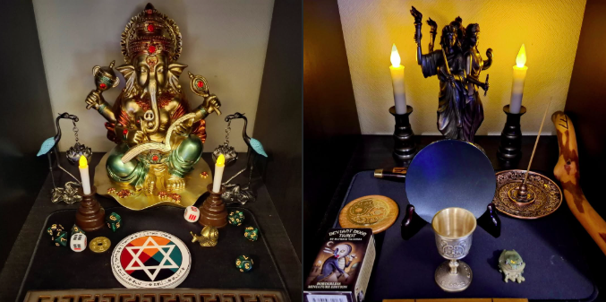

# 🔥ベルテイン／5月の祭の祝祭プロトコル

この文書は、RavensgateにおけるBeltaine（ベルテイン／5月の祭）の祝祭プロトコルです。

この祝祭は、春と夏の境目に位置し、火、愛、喜び、創造力の高まりを祝うものです。
本書では「正式版」の儀式のみを掲載しています。儀式文は英語と日本語の両方を併記しています。

ドロレス・アッシュクロフト＝ノーウィッキーの出版・公開されている儀式の語り口や、
バックランドの『ブルーブック』に触発されつつ、現代的なソロ実践者のために構成しています。

祝祭自体は「男神と女神」の象徴に基づいて行うものであり、特定の神格への呼びかけは行いません。

<div align="center">
  
</div>

---

### 🔹準備する物
- ローブ（白、または黒／紫など位階を象徴するもの）- オプション
- 魔法円（フラフープ円／視覚的サークル）- オプション
- LEDキャンドルを円周に配置 - オプション
- The Lovers カード（Deviant Moon Tarot）- 他のデッキでもOK
- ワインとビスケット（またはジュースと軽食）
- 土と灰（小皿に）
- ワンド（アサメイではなくワンド推奨）
- 水を入れた杯
- ベル

### 🔹Ritual Text（儀式文）

**(English)**
```
[Step into the circle. Ring bell 3 times.]

In the name of the Goddess who dances in the flames,
I open this circle on the night of Beltaine.

I call upon joy, union, and sacred passion.
I place the Lovers at the center of my work.

[Draw the pentagram to open the circle. Begin at the top point to the lower left.]

[Touch the earth, sprinkle the ash]
From soil and ash, all cycles begin again.

[Dip the wand into the cup of water]
May light and darkness unite within me.

[Raise the cup and food]
May I be nourished by life, and nourish life in return.

[Drink the wine, eat the biscuit]

I dance the fire within. I honor the union of light and shadow.

[Draw the pentagram to close the circle. Begin at the lower left to the top point.]

So may it be.
```

**（日本語訳）**
```
［円に入り、ベルを3回鳴らす］

炎の中で舞う女神の御名において、
私はこのベルテインの夜に円を開く

喜びと結び、聖なる情熱をここに招く。
恋人たちのカードを、私の作業の中心に置く

［五芒星を描いて円を開く。頂点から左下に向かって開始］

［土に触れ、灰を撒く］
土と灰から、すべての循環は再び始まる

［ワンドを水の杯に浸す］
光と闇の結合が、私の内にありますように

［杯と食物を掲げる］
私は命に養われ、命を養う存在となる

［ワインを飲み、ビスケットを口にする］

私は内なる炎とともに踊り、
光と影の結合を讃える

［五芒星を描いて円を閉じる。左下から頂点に向かって開始］

そうあれかし
```

---

この儀式は魔術ではなく、祝祭です
Deviant Moon Tarot や本棚神殿、フラフープ魔法円といった現代的な象徴を取り入れながら、
火と生命の力を讃えるこの夜を、心から祝ってください

---
<div align="center">
  
</div>

---

© 2025 知られざる呪術師（Le Sorcier Inconnu）  
本ドキュメントは [Creative Commons BY-SA 4.0](https://creativecommons.org/licenses/by-sa/4.0/deed.ja) に基づき公開されています。
